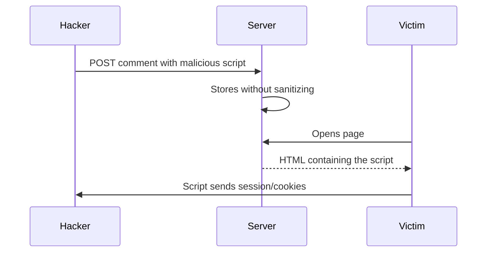
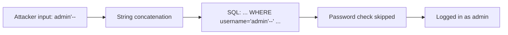
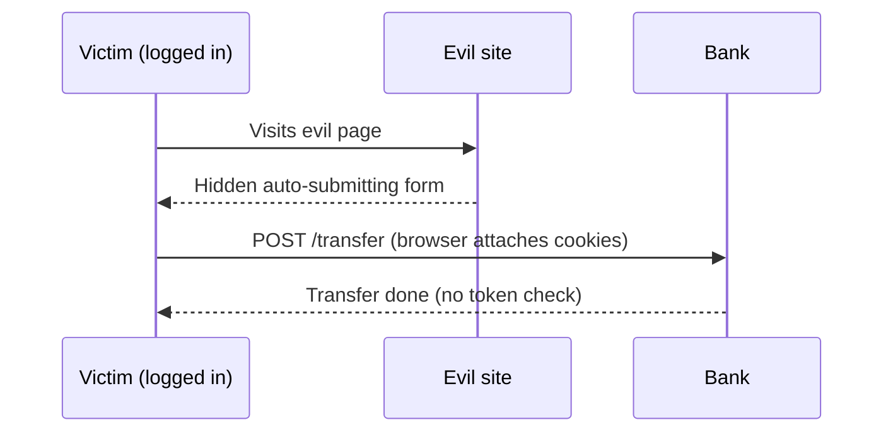
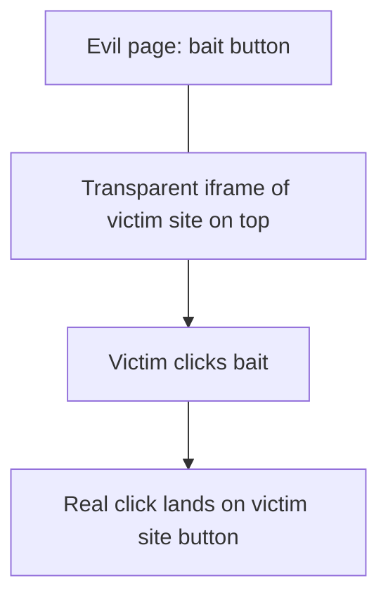
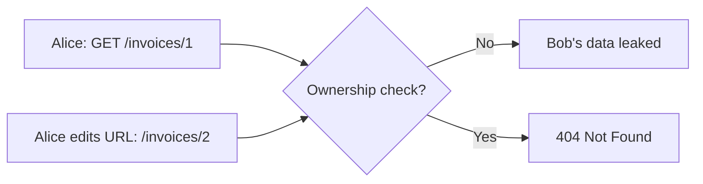

# 🔄 Attack Flows

## XSS

```mermaid
sequenceDiagram
  participant H as Hacker
  participant S as Server
  participant V as Victim
  H->>S: POST comment with malicious script
  S->>S: Stores without sanitizing
  V->>S: Opens page
  S-->>V: HTML containing the script
  V->>H: Script sends session/cookies
```

## SQL Injection

```mermaid
flowchart LR
  A[Attacker input: admin'--] --> B[String concatenation]
  B --> C[SQL: ... WHERE username='admin'--' ...]
  C --> D[Password check skipped]
  D --> E[Logged in as admin]
```

## CSRF

```mermaid
sequenceDiagram
  participant V as Victim (logged in)
  participant E as Evil site
  participant B as Bank
  V->>E: Visits evil page
  E-->>V: Hidden auto-submitting form
  V->>B: POST /transfer (browser attaches cookies)
  B-->>V: Transfer done (no token check)
```

## Clickjacking

```mermaid
flowchart TB
  A[Evil page: bait button] --- B[Transparent iframe of victim site on top]
  B --> C[Victim clicks bait]
  C --> D[Real click lands on victim site button]
```

## IDOR

```mermaid
flowchart LR
  A[Alice: GET /invoices/1] --> B{Ownership check?}
  C[Alice edits URL: /invoices/2] --> B
  B -- No --> D[Bob's data leaked]
  B -- Yes --> E[404 Not Found]
```
